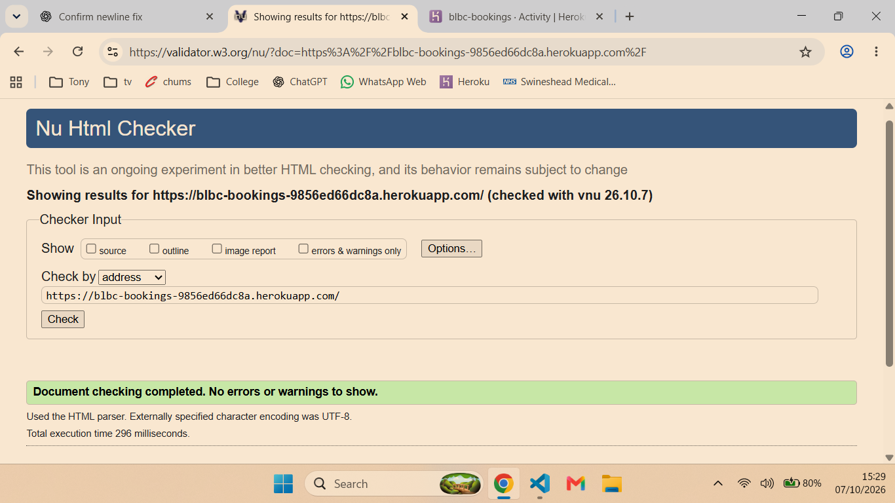
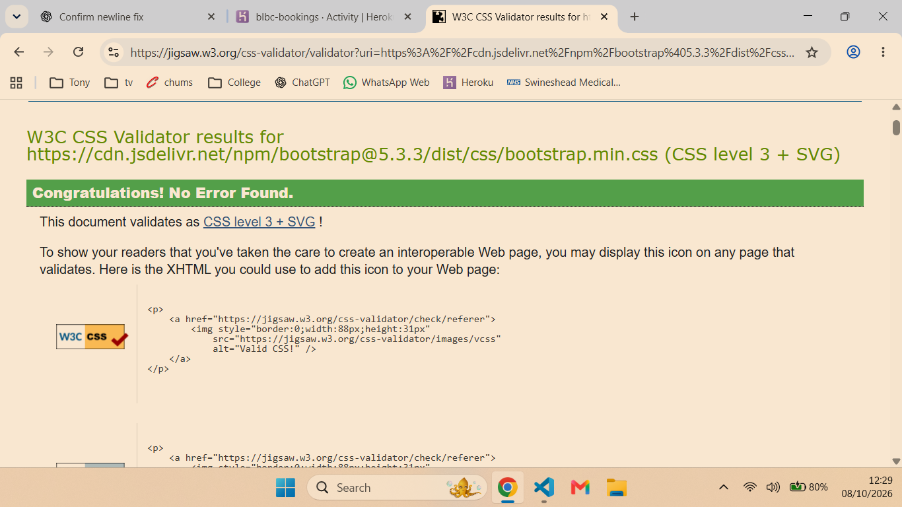
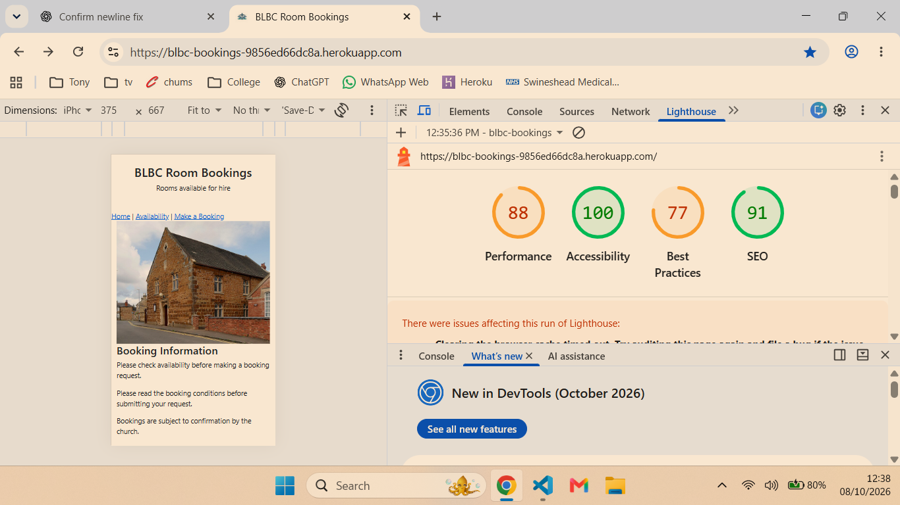
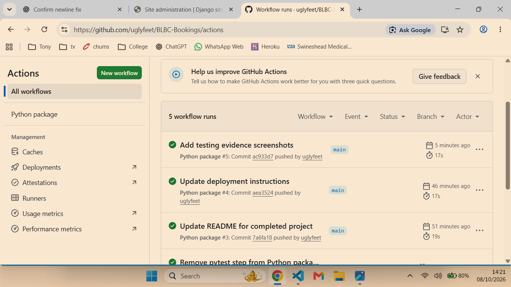
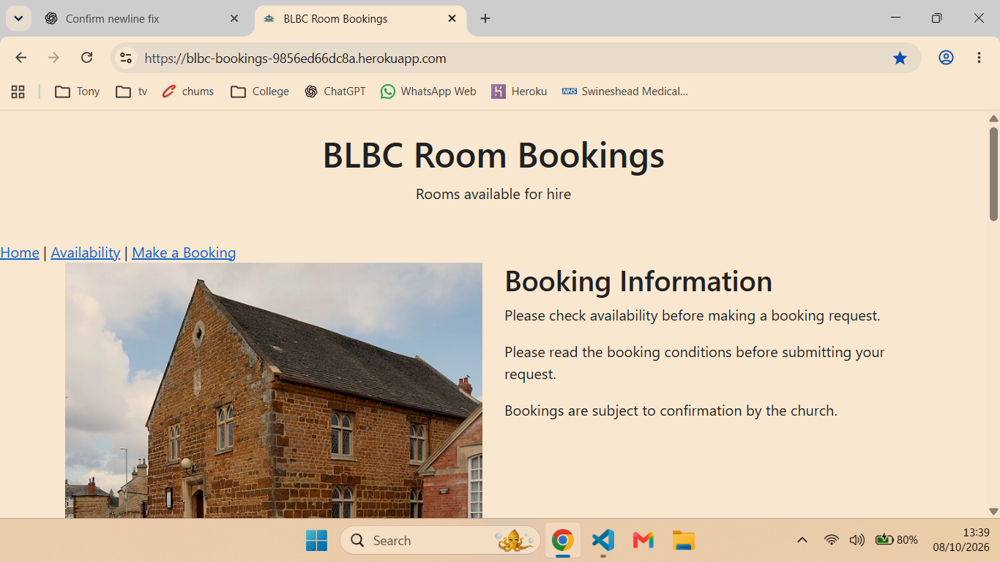
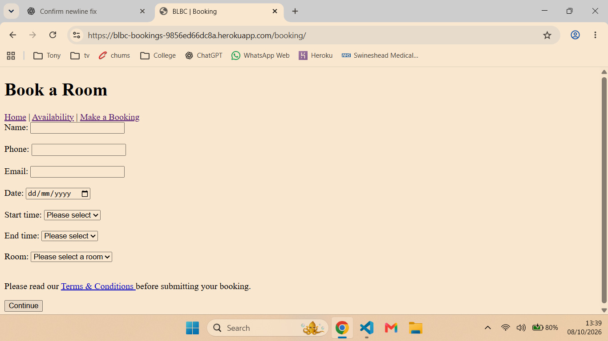
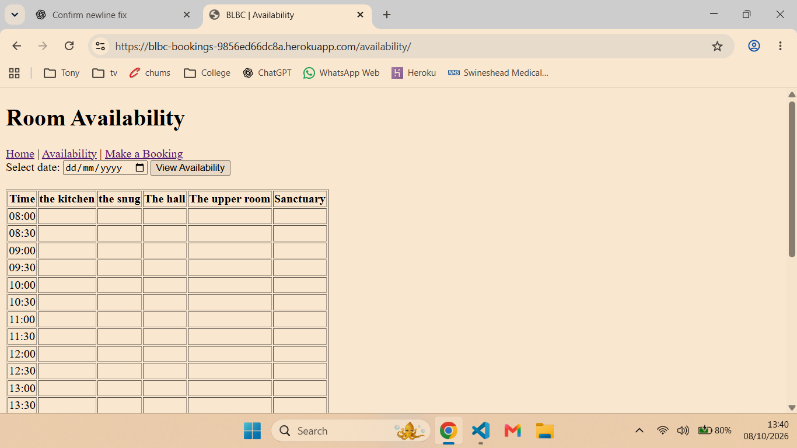
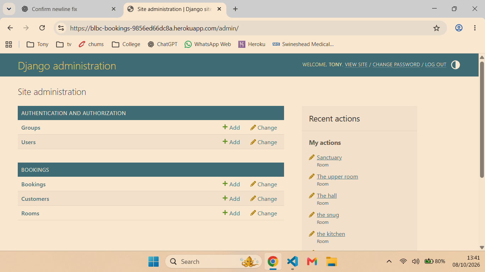

# Testing Strategy

The BLBC Booking System will be tested throughout development to ensure it meets the functional and non-functional requirements.

The following types of testing will be carried out:

- Manual testing of all user functionality.
- Automatic testing of HTML and CSS
- Validation testing of all form inputs.
- Responsiveness testing on desktop, tablet and mobile devices.
- Browser compatibility testing.
- User acceptance testing to ensure the system meets user requirements.

Test results will be recorded during the development phase.

## Test Evidence

### HTML Validation

### CSS Validation

### Lighthouse

### GitHub CI

### Home page

### Booking page

### availabilty page

### Admin page
